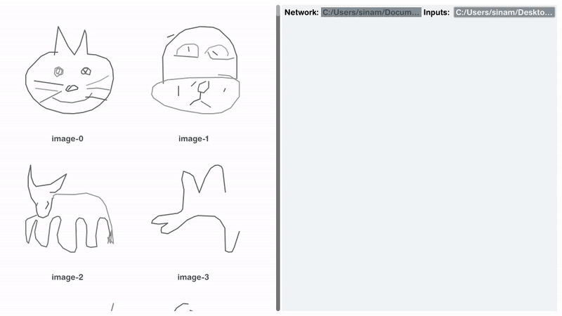

# Godot Neural Network Framework




## Introduction

This project is a fully standalone machine‑learning framework built entirely in Godot Engine using pure GDScript and GLSL compute shaders. It is designed for researchers, students, and developers who need a lightweight yet powerful neural network toolkit capable of running fully accelerated training and inference directly inside interactive applications — without relying on external dependencies, Python bindings, or cloud runtimes.

The architecture combines GPU‑optimized pipelines for forward and backward passes with CPU‑accessible layers for hybrid workloads, leveraging low‑level SPIR‑V shaders for maximal performance and portability. This allows seamless integration of neural networks into real‑time simulations, games, and creative tools, while maintaining reproducibility and deterministic behavior within the Godot ecosystem.

Out‑of‑the‑box, the framework provides:

Customizable neural network architectures (dense layers, activations, schedulers).
Real‑time dataset handling for images, numerical data, and procedural inputs.
Training visualizations and live performance metrics.
Interactive demos including digit and doodle classification with high accuracy and sub‑second inference times.
Whether used for rapid prototyping, educational purposes, or embedding ML into production‑ready interactive software, this framework demonstrates how far neural computation can be pushed in native Godot without external ML libraries.

## Features

- **Native Neural Network Engine** — Built entirely in GDScript and GLSL compute shaders within Godot, providing a standalone ML runtime with zero external dependencies. All core modules (layers, activations, losses, dataset handling, serialization) are optimized for seamless integration into games, simulations, and educational tools.
- **GPU‑Accelerated Inference & Training** — Forward and backward passes are parallelized on GPU using SPIR‑V‑level compute shaders, enabling sub‑second inference times and significantly faster training cycles. Batching and memory access patterns are tuned to minimize data transfer overhead between CPU and GPU.
- **Flexible Activation Functions** — Includes Sigmoid, Tanh, ReLU, Leaky ReLU, and Softmax cores, all implemented with shader‑level optimizations for speed and stability. Custom activation functions can be integrated easily through the modular shader API, enabling experimentation with novel architectures.
- **Comprehensive Regularization** — Robust tools to prevent overfitting and improve generalization, including L2 weight decay, stochastic dropout at the shader level, and adjustable learning‑rate schedules (step decay, exponential decay, warm‑up phases) for fine‑grained convergence control.
- **Versatile Loss Functions** — Optimized implementations of Mean Squared Error (MSE), Binary Cross‑Entropy, and Categorical Cross‑Entropy (CCE), with batched GPU evaluation for efficient handling of large datasets.
- **Gradient Clipping for Stability** — Integrated clipping mechanisms ensure gradients remain within safe bounds during backpropagation, reducing the risk of divergence in deep or high‑learning‑rate models.
- **Built‑In Demo Suite** — Includes ready‑to‑run Godot scenes demonstrating real‑world tasks: digit classification on 9k images achieving 97% accuracy, doodle recognition across nine categories, and live predictive displays with confidence scores calculated in real‑time.

## Architecture Overview

The framework is structured into modular layers and execution pipelines, enabling a clear separation between **data handling**, **model definition**, and **compute execution**. This design ensures each component can be extended or replaced without affecting the rest of the system.

### Core Components

- **Data Layer (`/scripts/neural_network/data`)** — Imports, preprocesses, and batches datasets for training and inference. Handles images, numerical data, and procedural inputs.
- **CPU Layer (`/scripts/neural_network/core`)** — Implements neural computations and utility logic in pure GDScript for fallback or hybrid execution modes.
- **GPU Layer (`/scripts/neural_network/gpu`)** — Manages shader loading, SPIR‑V pipelines, and compute kernels. Executes forward and backward passes with optimized parallelism.
- **Training Engine (`/scripts/neural_network/training`)** — Coordinates the training loop, loss calculations, regularization, gradient clipping, and learning‑rate schedules.
- **Serializer (`/scripts/neural_network/serializer`)** — Saves and loads trained models with reproducible configuration states.
- **Visuals (`/scripts/visuals`)** — Interactive and real‑time visualization tools such as the Loss over Epoch graph, performance monitors, and UI components for model training feedback.
- **Examples & Demos (`/examples`)** — Ready‑to‑run Godot scenes showcasing training workflows, inference, and visualization tools in action.

### Data Flow

1. **Load & Preprocess Data** → Dataset manager prepares batches.
2. **Forward Pass** → Input flows through CPU fallback or GPU‑optimized compute shaders.
3. **Loss Calculation** → Outputs are compared against target labels using GPU‑optimized loss functions.
4. **Backward Pass** → Gradients are computed on GPU, optionally clipped for stability.
5. **Weight Updates** → Regularization applied, learning‑rate schedules adjusted.

## Installation

This framework is a fully standalone ML module for Godot Engine, requiring **no external dependencies**.  
You can use it either as a separate workspace for experiments or embed it directly into your own game/application.

### Prerequisites

- **Godot Engine 4.x+** (requires Vulkan for compute shader support)
- GPU with Vulkan‑compatible drivers
- Optional: Familiarity with GDScript and GLSL for extending networks or runners

### Quick Install

1. **Clone the Repository**

```bash
   git clone https://github.com/SinaMajdieh/godot-neural-network.git
```

2. **Open in Godot**

- Launch Godot.
- Click Import Project.
- Navigate to the cloned repository and select project.godot.

3. **Verify GPU Compatibility**

- Ensure your GPU supports Vulkan and compute shaders.
- In Godot, check Project Settings → Rendering → Quality → Compute Shaders Enabled.

4. **Run a Demo Scene**

- In the FileSystem dock, open `/examples/classifier/digit_classier.tscn` or any demo.
- Press Play to verify the framework runs correctly.

### Embedding in an Existing Project

1. Copy `/scripts/neural_network` into your project directory.
2. Adjust resource paths in scripts as needed.
3. Start creating networks and trainers directly in your scripts.

## Usage

The framework is built for fast prototyping and easy integration.
You can create networks, set up GPU runners, train models, visualize training, and export/import them — all from GDScript.

### Example: Creating a network

```gdscript
# --- Create GPU runners ---
var forward_runner: ForwardPassRunner = ForwardPassRunner.new()

# --- Configure network ---
var network: NeuralNetwork = NeuralNetwork.new({
		ConfigKeys.NETWORK.LAYER_SIZES: [42, 32, 16, 15, 8, 4],
		ConfigKeys.NETWORK.RUNNER: shader_runner,
		ConfigKeys.NETWORK.HIDDEN_ACT: Activations.Type.TANH,
		ConfigKeys.NETWORK.OUTPUT_ACT: Activations.Type.SOFTMAX,
		ConfigKeys.NETWORK.WEIGHT_INIT: NetworkLayer.WeightInitialization.XAVIER
})
```

### Example: Training a Network

```gdscript
# --- Create GPU runners ---
var backward_runner: BackwardPassRunner = BackwardPassRunner.new()

# --- Dataset split ---
var split: DataSplit = DataSetUtils.train_test_split(
  training_inputs,
  training_targets,
  test_size_ratio
)

# --- Configure trainer ---
var trainer: Trainer = Trainer.new({
		ConfigKeys.TRAINER.NETWORK: network,
		ConfigKeys.TRAINER.RUNNER: backward_runner,
		ConfigKeys.TRAINER.LOSS: Loss.Type.CCE,
		ConfigKeys.TRAINER.LEARNING_RATE: 0.07,
		ConfigKeys.TRAINER.LAMBDA_L2: 0.002,
		ConfigKeys.TRAINER.EPOCHS: 200,
		ConfigKeys.TRAINER.BATCH_SIZE: 1024,
		ConfigKeys.TRAINER.GRADIENT_CLIP_OPTIMIZER:
			GradientClipOptimizer.new(
				true,
				1.0
			)
})

trainer.lr_schedular = LRSchedular.new(LRSchedular.Type.COSINE, 200, 0.01)

# --- Train ---
trainer.train(split.train_inputs, split.train_targets)
```

### Example: Exporting a Model

```gdscript
# Save the trained network to disk
NeuralNetworkSerializer.export(network, export_path)
```

### Example: Importing a Saved Model

```gdscript
# Create a forward runner for inference
var forward_runner: ForwardPassRunner = ForwardPassRunner.new()

# Load a saved network
var network: NeuralNetwork = NeuralNetworkSerializer.import(forward_runner, network_path)

# Use network for inference...
```

### Example: Adding a LossGraphPanel to Your Scene

```gdscript
# Instantly create and attach a Loss over Epoch visualization panel.
var loss_panel: LossGraphPanel = LossGraphPanel.new_panel(
	"Training Loss",   # Panel title
	200,               # Max data points to store
	Color("61AFEF")    # Line color
)
add_child(loss_panel)

# Later, during training:
loss_panel.add_loss(current_loss)
```

### Why This Matters

- **Modular by Design** — Use only the components you need (datasets, GPU runners, training logic).
- **Embedding-Friendly** — Networks, trainers, and serializers work in any Godot script.
- **Production-Ready** — Export trained models and load them in runtime environments without retraining.
- **Real-Time Capable** — Forward passes are GPU‑accelerated and optimized for interactive applications.

## Demo Showcase

Below are three example demos included in the `/examples` folder.  
GIFs demonstrate live performance inside Godot, running with GPU‑accelerated forward passes and interactive tools.

### Digit Recognition Demo

Trains a neural network on **9,000 images of digits** (0–9),  
achieving **~97% test accuracy** using Categorical Cross‑Entropy loss and Tanh activations.  
**GIF Preview:**


---

### Doodle Recognition Demo

Trains on **9,000 images** across **9 doodle categories** (e.g., lighthouse, guitar, cat),  
demonstrating the framework’s flexibility with different datasets and input types.  
**GIF Preview:**


### Loss over Epoch Visualization Tool

Provides a **real‑time interactive graph** of training loss over epochs,  
featuring smooth interpolation, hover tooltips with exact loss values, and theme‑driven styling.  
Helps visually monitor convergence stability during training.  
**GIF Preview:**


### Motivation

Machine Learning frameworks are abundant — but almost all require heavy external dependencies,  
Python bindings, or separate runtime environments. For real‑time applications in **game engines** like Godot,  
this creates friction: extra toolchains, limited in‑engine GPU acceleration, and fewer opportunities for live interaction.

This project began as a personal challenge:  
to experiment, understand how neural networks work at their core, and build something powerful from scratch.  
It reflects a passion for creating tools, testing and fixing problems, and pushing technical limits —  
showing what one person can achieve through learning and dedication.

It also stands as proof of the **untapped potential of game engines** for live simulations, training demos, and interactive AI experiences,  
where neural networks can run seamlessly, natively, and in real time — no external dependencies needed.

### Vision

I aim to make Machine Learning in Godot as natural and accessible as working with any other built‑in system:

- **Unified Workflow** — Build, train, and deploy networks entirely inside Godot scenes.
- **Real‑Time AI** — GPU compute shaders delivering instant inference for gameplay, VR, education, and simulation.
- **Modular Extensibility** — Easy addition of custom layers, activations, loss metrics, and schedulers.
- **Educational Accessibility** — Clear demos, visualizations, and approachable code for rapid learning.
- **Open Innovation** — Lightweight, open‑source, and community‑driven.

Future goals include:

- Support for advanced architectures (CNNs, RNNs, attention/transformers).
- Expanded visualization tools for debugging and understanding.
- Dataset generation utilities for creative and synthetic data.
- Showcasing the full power of interactive, GPU‑driven AI in games and simulations.

## Tech Stack

This framework is built entirely inside the **Godot Engine** ecosystem, using only native scripting and shader technologies.  
There are **no external dependencies** — making it portable, lightweight, and easy to embed into any Godot project.

### Core Technologies

- **Godot Engine 4.x** — Game engine platform & runtime environment.
- **GDScript** — Primary language for network logic, data handling, and orchestration.
- **GLSL Compute Shaders** — GPU acceleration for forward/backward neural network passes.
- **SPIR‑V** — Low‑level shader intermediate representation for optimized GPU workloads.
- **Godot Resource System** — Used for datasets, model serialization, and configuration storage.

### ML Components

- **Custom Neural Network Engine** — Implemented directly in GDScript & GLSL.
- **GPU‑Accelerated Training Pipeline** — Runs matrix ops, activation functions, and loss calculations in parallel.
- **Regularization Support** — Dropout, L2 weight decay, gradient clipping.
- **Multiple Activation & Loss Functions** — Sigmoid, Tanh, ReLU, Softmax, MSE, BCE, CCE.
- **Dataset Utilities** — Loading, preprocessing, train/test splitting.

### Development & Testing

- **Godot Scenes for Benchmarks** — Unit tests and performance measurements.
- **Examples & Demos** — Digits and doodle recognition with live classification.

## License

This project is licensed under the **MIT License**.  
You are free to use, modify, and distribute this software for personal and commercial purposes,  
provided that the original copyright notice and permission notice are included in all copies or substantial portions of the software.

See the [LICENSE](LICENSE) file for the full text.
